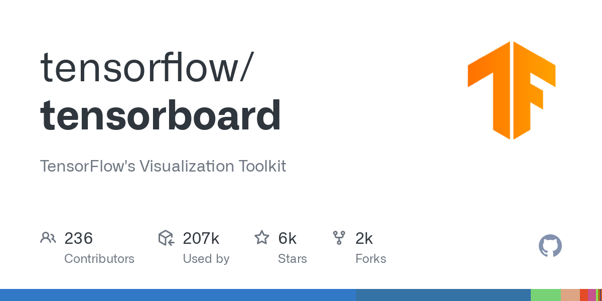

# Loading and Fine-tuning pre-trained LLMs 
This project shows how to load and fine-tune pre-trained LLMs, such as llama-2.   

You can read more about the llama-2 model [here](https://ai.meta.com/llama/). 

  

This project utilizes the [Hugging Face API](https://huggingface.co/) to load the model and also demonstrates how to save it. 

  

[Tensorboard](https://www.tensorflow.org/tensorboard) was utilized to visualize the training loss.

  

Steps involved in this project. 
* Load the *Llama-2-7b* LLM from hugging face. 
* Load the *guanaco-llama2-1k* dataset to finetune the LLM. 
* Define the model and fine-tuning parameters. 
* Train the model on the new parameters. 
* Utilize *tensorboard* to visualize the training loss. 
* Push the new model to a user's hugging face account. 
* Test out the new model by providing a prompt.  
